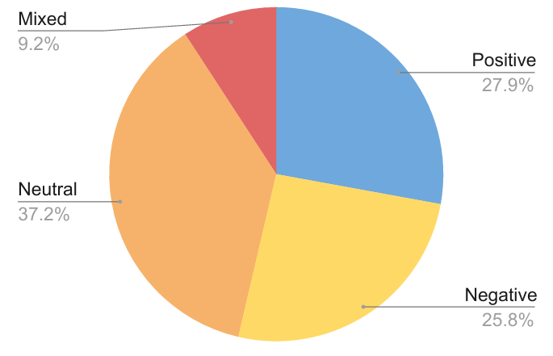
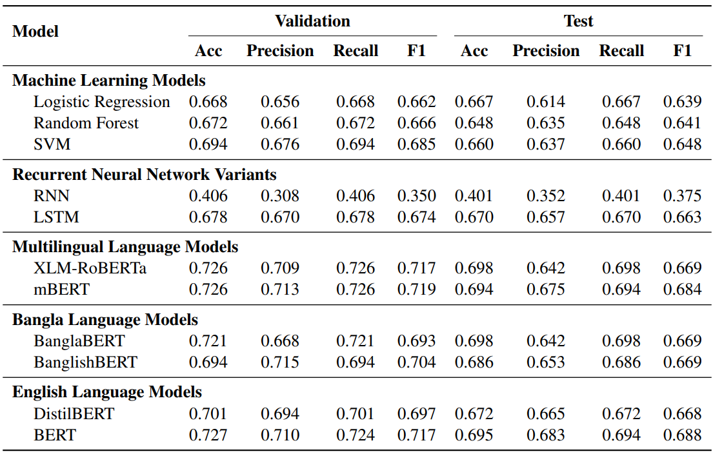

<div align="center">

# BnSentMix: A Diverse Bengali-English Code-Mixed Dataset for Sentiment Analysis

</div>

<p align="center">
  <a href="*sadiaalam@iut-dhaka.edu*"><strong>Sadia Alam</strong></a>
  ·
  <a href="https://farhanishmam.github.io/"><strong>Md Farhan Ishmam</strong></a>
  ·
  <a href="navidhasin@iut-dhaka.edu"><strong>Navid Hasin Alvee</strong></a>
  ·
  <a href="shahnewaz@iut-dhaka.edu"><strong>Md Shahnewaz Siddique</strong></a>
  ·
  <a href="https://cse.iutoic-dhaka.edu/profile/azam/"><strong>Md Azam Hossain</strong></a>
  ·
   <a href="https://cse.iutoic-dhaka.edu/profile/raihan-kamal/"><strong>Abu Raihan Mostofa Kamal</strong></a>
</p>

<div align="center">

[](https://arxiv.org/abs/2408.08964)
[![anthology](https://img.shields.io/badge/ACL%20Anthology-LoResLM@COLING%202025-EE161F?logo=data:image/png;base64,iVBORw0KGgoAAAANSUhEUgAAAIoAAABgCAYAAADCWOqAAAAACXBIWXMAAAsTAAALEwEAmpwYAAAHSklEQVR4nO2dz28bRRTHWztOUmhS50ehad0oaCv+CSQE4uBLJISE6KESvuQP4IKAfwApKOKOEEgcLCNuqHS7B6QWJCgSgkS4sVsCWCBEwTv7muan83PRJONms+yud531vFn2Hb6y157dzLz3yZs3453ZU8U3pk+RyAbFDjY4dgAAp50igIKNBy57yZRs31A0OaEBgUChcKwqJIAQXSiixB9NxgBgBADGAeAcAOQBYFRoRMj9ftRxXvu4XSbv+p5fc1ioTxYwsV4sbbkNuJxk3l2csl4s2rJkfvgRAEBWKiidwlrYiqgQJrFAac4vPAMFzbYkyZyd23RGFVRQuoXGr4xK/e5JwAAPNecXpiSDstYGpddtj+S8OJKsgPIZIaWSvU7XheMRZRIK2r5kULJSQOlg5AEAGBTqF/R6KSvUfp/xUBAcXvK7TlT15J8AXKCIiDKBAEpGNihOo2aspaWSeePmOtONPR/t+mib6caO0LZDLaYbmy61P9twfb7lOKflKtcu23JpS7zy73m915hurIr36+I91wrTjWWmG8B0w2S60WC6sch0Y57pxh2mG18z3bjFdONLphsG040bTDeuM934gunGTXH8GdOND5huvM90Y47pxttMN15/8PEnb6YBFCcsA1b504ds8opNimYDWZAIUFZlg5JxvQ5Z5cqWzEaTtG5AWcEGJW+VK9vkPLUBNhUA5ZxVruxgG4KkdQLlEfdZryEJAuVJiijqg2rOzi1jgzJolSstbEOQtE6gPMQC5fH8iVWurJKj1IbVnJ0D2aC41W+VKyvYhiBpoUDBTGY5KGvkKLVhNWfnLOwJtxxFFHwQrISA8gjbECRNua7H/SMdB2WZHKU2rKYioFjYhiBpiQCFkaOSMY8CiKDwUU8T2xAkLdTMLDYo/5Cj1IbVRAAl4wHKA2xDkDSlJ9zaoPxJjkpEjpLFnpn9A9sQJC1M14MKCh/1/E6OUhtWEzlHaYPSwDYESQt14xI2KL+RoxIBShYblF+xDUHSwtwziw7KEjkqEaDksEH5GdsQJC1M19OPCUqfVa7cJ0epDat5uAAMDZSMAOWe5Ibz5SF71uGSzLBynu/+bs+lXQ/tCPE1THzB26ZQS7xuOD7bdBy3XGX43YD81tG1NIJSl9VgKGgbjVu3J5vV6kCzWh1qVqvDzWr1rEtDDp11vJ5xiJ/f36xWcx7qE/L7PCvkLNfnoayrXPu4/y/9Jt8fZS9NoGStcmVRIiibjXrtqaCdA8KoFwYK8zfgaDeDMcmL1FfFjhOoEUVajgIFbb1Rr13otdN7KTgEZQRhN4NBGe1TYtRz0PXUaxdlR4tugQBXfRwRJS8ZlHUVQJEZUbYa9VoBs4uJA55mCkA5rQAoE0mEpHgclBEEUAYwQDmN1PVsN+q1S2HhUBEYOARlVDIoG7KTWS9QliRHlP/kKEH/varBAjig8GQ23aAEOURFSOAQlHGE7UPRu55fJINyrOvp5JR2GRWggSNQzksG5aDrST0oKkAQEZSnCZTeR5TLnZJZVfOT4lGOMoGwxXmqIgof9UyGnUdRERg4BOVi2kDpk5zMbgdFlASBMpFGUO5LBmUqDBR+xymOKLk0gbLTqNeeDRM5VIwucJTMygalxX0VVxuSAMpuGFBUhKR4HJRLSQXlJBHlnkqg+HU3soEBn58UkEDZimNmNoztEgeKiokuHIEiO5ndBoAzcYESdJ0gUOqSQbmSFDCKPsb+P4Did60gUBaTBAo2JIADypZ46FbXdnCf53edIFDuSgRlr1GvaaoDAh0S6+b8wgWE4bHnU86iRJAw8jspiwCK7/0ocSsOUIoenyGA8vgJYL22lyqg8HmUMbGOtv0cwwHXswxzQv1dKue6jlt+z0vsc5VzXnNAiH+ebc4vXJYMSsPVrqyPvNrtbMMTItfJdRNRarIazPX3K6+tmVev7ZtXr9kJ1b758qvS1vQcgPLcC/zv7sZmt3ffWxFPa1ez6yFpatigNMNHUeejgvITesVJtmRQeHI8HgWUjFWuzJOjUgZraabVDSg/oFecZEsGhc/LjEUF5Q45KmWwlroD5TZ6xUk2AiijBAqBZ4dIZiMNjymipBGq0gxfopqPCspX6BUn2QignKOIQuDZHUBZ6waUb8mwKYtqpRm+g9Nw1JlZmnDDdlxBbVDae7jRPAq24wrJiCgECrbjCgQKvlFItkdE4bcZDEWNKN+RMVMGVGnmUVRQ+KjnR/SKk2wEUIajgvI9OSplsJZmlruZR/kGveIkGyGiECgEntYTUGhmNr1dT4ZyFGxnFJQfHuejDo9p1JPOHwXzUUGpolecZCNM4YcChR4Vl2Y4SwcRZSQqKPTc4/Su68mEB+Xz6wvW8y/ZpFhtsC8UpayXeuGXfeutd5i4uToUKD1fHZ9kFU+wQU2v63HCawb6/lRSN68hTce+70uQ3E8AI0hSCiEcjyzxgUIRZTqVEYVgUMBhRYXA6AgKdiNI08rZgIPyLw8NNdMBmSIIAAAAAElFTkSuQmCC&style=flat")](https://loreslm.github.io/)
[](https://github.com/Nishita2000/BnSentMix)
[](https://huggingface.co/datasets/aplycaebous/BnSentMix)
[](https://drive.google.com/file/d/12OeZDEZJUVym39iVnE4BLdGFss9HP9SO/view?usp=sharing)
[](https://drive.google.com/file/d/1Hn8a6jutymAhXzBIHhpWnZyf8M5upqLl/view?usp=sharing)
</div>

We introduce BnSentMix, a sentiment analysis dataset of code-mixed Bengali-English consisting of 20,000 samples and 4 sentiment labels. 
Code-mixed Bengali-English texts consist of Bengali and English words written in English characters. 
We also propose a novel pipeline to filter code-mixed Bengali-English texts using pre-trained language models. 

---

## Dataset Overview

Column Title | Description
------------ | -------------
`Data Sources` | Facebook, YouTube, E-commerce Sites
`#Samples` | 20000
`Sentiment Labels` | Positive, Negative, Neutral, Mixed
`Filtering Method` | Automated using `mBERT`
`#Annotators` | 64
`Annotation/Sample` | 2 or 3 (if tie)

## Dataset Statistics

| Statistic               | Value  |
|-------------------------|--------|
| Mean Character Length    | 62.77  |
| Max Character Length     | 1985   |
| Min Character Length     | 14     |
| Mean Word Count          | 11.65  |
| Max Word Count           | 368    |
| Min Word Count           | 4      |
| Unique Word Count        | 37734  |
| Unique Sentence Count    | 21873  |

## Sentiment Composition



## Experiments

The `.pynb` notebooks for the automated data filtering and sentiment classification models can be found in the `notebooks` directory.

## Results



## Citation

If you find this work useful, please cite our paper:

```bib
@misc{alam2024bnsentmixdiversebengalienglishcodemixed,
      title={BnSentMix: A Diverse Bengali-English Code-Mixed Dataset for Sentiment Analysis}, 
      author={Sadia Alam and Md Farhan Ishmam and Navid Hasin Alvee and Md Shahnewaz Siddique and Md Azam Hossain and Abu Raihan Mostofa Kamal},
      year={2024},
      eprint={2408.08964},
      archivePrefix={arXiv},
      primaryClass={cs.CL},
      url={https://arxiv.org/abs/2408.08964}, 
}
```

